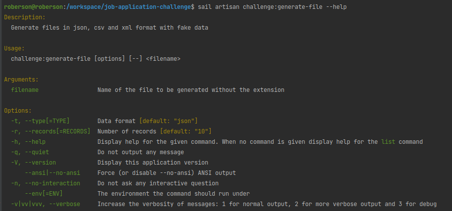
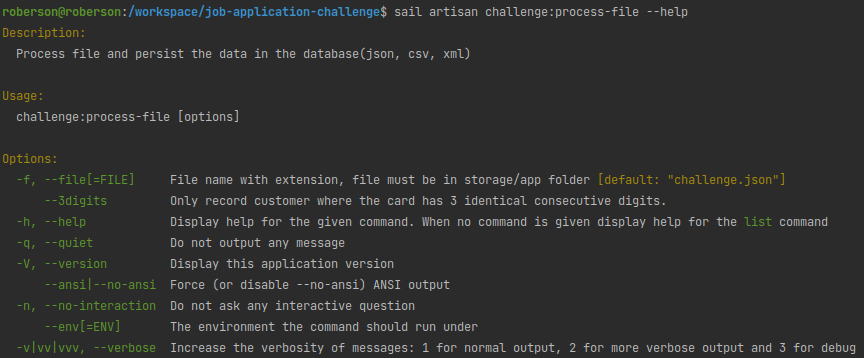

# Job Application Challenge
Attachment: JSON file: ["challenge.json"](storage/app/challenge.json).

## Task
Write a process that neatly writes the contents of the JSON file away to a database.
Preferably as a background task in Laravel. Use of Docker is allowed, but only if it makes it more fun.

We pay particular attention to the design and structure of the code. For example, we'd rather see a solid, neat, easily maintainable solution that doesn't work 100% of the time, than a finished solution that is messy and inimitable. We are particularly interested in the thinking behind your approach.

## Prerequisites:
- [Primary] Make the process such that any time it can be truncated (e.g., by a SIGTERM, power outage, etc.), it can continue in a robust, reliable manner exactly where it last left off (without duplicating data).1
- Design your solution "for growth," taking into account a hypothetical customer who will have new requirements each time.
- Use a solid, but not excessive database model. Code for Eloquent models and relationships are not important here, we are more concerned with the data structure.
- Only process records where the age is between 18 and 65 (or unknown).
  
## Bonus
  As an added challenge, we provide the following for consideration:
- What if the source file suddenly becomes 500 times larger?
- Is the process easily deployed for an XML or CSV file with similar content?
- Suppose that only records need to be processed for which the credit card number contains three consecutive same digits, how would you handle that?

1 Note that there is no guarantee that there are no duplicate records in the source file (there
  are no guaranteed unique (combinations of) properties) - and all duplicates do need to be
  replicated 1-to-1 in the database.

# Run the app

## Requirements

- Docker
- Laravel Sail([Configuring A Bash Alias](https://laravel.com/docs/8.x/sail#configuring-a-bash-alias))

## Steps to start app

#### Clone the projetc
```bash
$ git clone https://github.com/robersonfaria/job-application-challenge.git
```

#### Copy `.env.example` to `.env`
```bash
$ cp .env.example .env
```

#### Download project dependencies
```bash
$ docker run --rm \
    -u "$(id -u):$(id -g)" \
    -v $(pwd):/var/www/html \
    -w /var/www/html \
    laravelsail/php81-composer:latest \
    composer install --ignore-platform-reqs
```
#### Run the project's containers.

In the scale parameter, the number of containers that will process the queue can be chosen, the more containers thefaster the processing.

```bash
$ sail up --scale laravel.queue=8
```

#### Create the tables in the database
```bash
$ sail artisan migrate
```

## Steps to run flows

Basic flow, load the challenge.json file and record the data in the database(only people between 18 and 65 years old).
```bash
$ sail artisan challenge:process-file 
```

Basic flow, load the challenge.json file and filter only customers with card number with 3 consecutive equal digits
```bash
$ sail artisan challenge:process-file --3digits 
```

## Extra features

Generate csv, xml or json file with faker data:
```bash
$ sail artisan challenge:generate-file --type=csv --records=10 filename
```


Process other files (non-default):
```bash
$ sail artisan challenge:process-file --filename=other_file.csv
```


## Run tests and coverage
```bash
$ sail composer phpunit
```
The coverage report can be consulted at [./coverage/index.html](./coverage/index.html)
